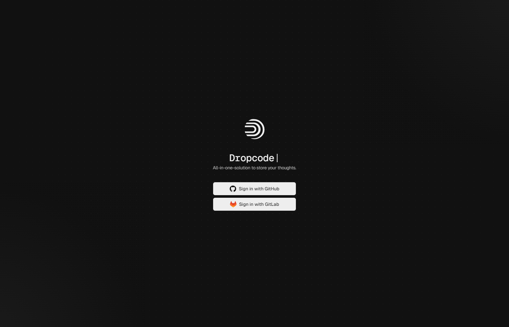
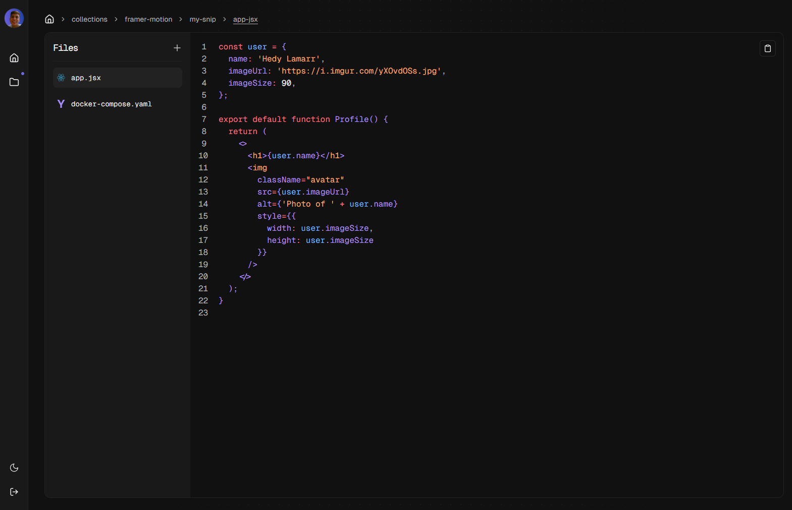

# Dropcode 🚀

 

 

 
 
 

  

 
 

**Dropcode** is a powerful tool designed to store and manage code snippets effectively. Whether you're working on a small project or handling multiple files within the same context, Dropcode makes it easy to organize and retrieve your code.

## Table of Contents 📚

- [Motivation](#motivation)
- [Features](#features)
- [Built With](#built-with)
- [Getting Started](#getting-started)
- [Usage](#usage)
- [Roadmap](#roadmap)
- [Contributing](#contributing)

## Motivation 💡

The need for a reliable way to store code snippets inspired the creation of Dropcode. In many development environments, it's common to have isolated code snippets that serve specific purposes. However, the ability to store more than one snippet in the same context is often limited. To overcome this, Dropcode introduces the concept of storing files within snippets, enabling more organized and context-rich code management.

## Built With 🛠️

Dropcode is built using a combination of modern tools and technologies:

- **[Next.js](https://nextjs.org/)**: React framework for server-side rendering and static site generation.
- **[React](https://reactjs.org/)**: JavaScript library for building user interfaces.
- **[Turborepo](https://turborepo.org/)**: High-performance build system for managing monorepos.
- **[Docker](https://www.docker.com/)**: Platform for containerizing applications.
- **[Prisma](https://www.prisma.io/)**: ORM for database management.
- **[Redis](https://redis.io/)**: In-memory data structure store for managing data.
- **[TypeScript](https://www.typescriptlang.org/)**: A strongly typed programming language that builds on JavaScript.
- **[Tailwind CSS](https://tailwindcss.com/)**: A utility-first CSS framework for creating custom designs.
- **[Shadcn](https://shadcn.dev/)**: Component library for modern UI elements.
- **[Zustand](https://github.com/pmndrs/zustand)**: A small, fast state management library.
- **[PostgreSQL](https://www.postgresql.org/)**: An open-source relational database system.
- **[Auth.js](https://authjs.dev/)**: Authentication library for JavaScript and TypeScript applications.
- **[Astro](https://astro.build/)**: A static site generator for building fast, modern websites.
- **[Radix UI](https://www.radix-ui.com/)**: Low-level UI primitives for building high-quality design systems.
- **[Nuqs](https://nuqs.47ng.com/)**: Type-safe search params state manager for Next.js.
- **[Recharts](https://recharts.org/en-US/)**: A charting library built with React and D3.
- **[Zod](https://zod.dev/)**: A TypeScript-first schema declaration and validation library.
- **[ZSA](https://zsa.vercel.app/docs/introduction)**: A library for building typesafe server actions in NextJS.
- **[React Query](https://react-query.tanstack.com/)**: A data-fetching and state management library for React.
- **[React Hook Form](https://react-hook-form.com/)**: A library for managing form state in React.
- **[Framer Motion](https://www.framer.com/api/motion/)**: A library for animations and interactions in React.
- **[Shiki](https://shiki.matsu.io/)**: A syntax highlighter for code.

## Roadmap 🛣️

### Upcoming Features

- [ ] **Latest Snippets Page**: Implement a page that displays the latest snippets with infinite loading and filtering by programming language.
- [ ] **Gist Integration**: Integrate with GitHub Gists to enable the retrieval and sending of code snippets.
- [ ] **Search Functionality**: Quickly find snippets using tags and keywords.

## Contributing 🤝

Contributions are what make the open source community such an amazing place to learn, inspire, and create. Any contributions you make are **greatly appreciated**.

If you have a suggestion that would make this better, please fork the repo and create a pull request. You can also simply open an issue with the tag "enhancement".
Don't forget to give the project a star! Thanks again!

1. Fork the Project
2. Create your Feature Branch (`git checkout -b feature/AmazingFeature`)
3. Commit your Changes (`git commit -m 'Add some AmazingFeature'`)
4. Push to the Branch (`git push origin feature/AmazingFeature`)
5. Open a Pull Request
